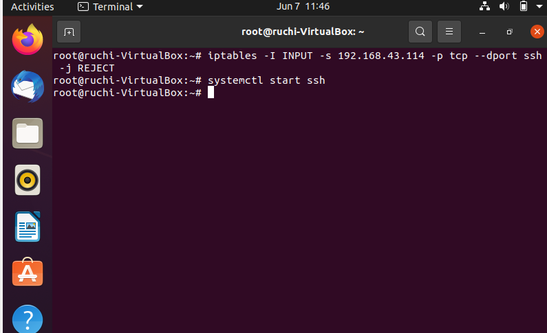
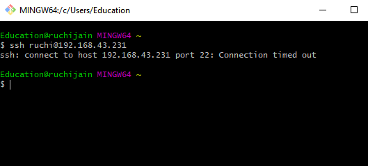
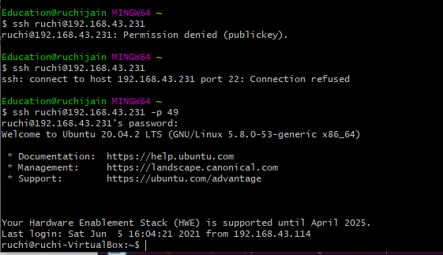

# 26thmay_B1_DEVOPS
### TASK 1
 
 iptables -I INPUT -s 192.168.43.114 -p tcp --dport ssh -j REJECT
 
 
 
### TASK 2
sudo vim /etc/ssh/sshd_config
#change port no "22" to "49"
# form git bash

ssh ruchi@192.168.43.231 -p 49

