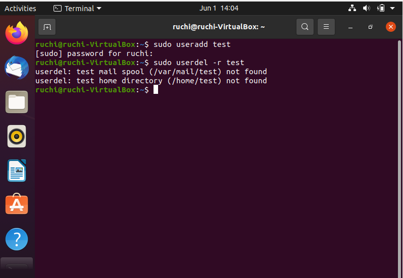

# 26thmay_B1_DEVOPS

### task 1
## for create a user
sudo useradd test 
## for delete a user with its home directory
sudo userdel -r test

### task2(b)
## for create a user 
sudo useradd ru
## in a specific shell-/usr/bin/dash
sudo usermod -s /usr/bin/dash ru
## for login "ru" user
su - ru
## for check the current shell
echo $SHELL

###task2(a)
## for create a user 
sudo useradd ru
## for disable its login
sudo passwd -l ru

