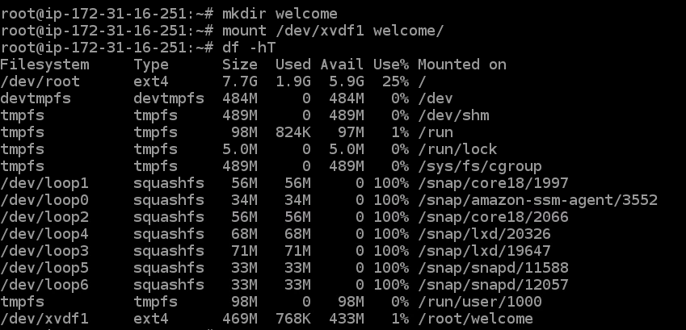
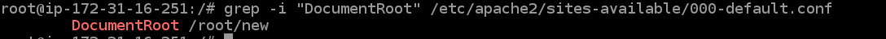

# 26thmay_B1_DEVOPS
## Task 1

after creating a volume

fdisk -l

for creating a partition

fdisk /dev/xvdf

type p

type n

enter //default partition type

enter    // first sector

+500M   // last sector 

w //saving the partition

mkfs.ext4 /dev/xvdf1 //formating

mmkdir welcome

mount /dev/xvdf1 welcome/   //for mounting at location /root/welcome

## task2

cd welcome

vim index.html // create index.html in mounted location "/root/welcome"

Hii LNB

### task 3 

after dettach the volume and attach to new instances

 apt install apache2 // for install apache2 
 
systemctl status apache2 // check the apache2 status

mkdir new

cd /etc/apache2/sites-available 

vim 000-defualt.conf

DocumentRoot "/Root/new"   // CHange the DocumentRoot /var/www/html to /root/new

grep -i "DocumentRoot" /etc/apache2/sites-available/000-defualt.conf  //to check the root

