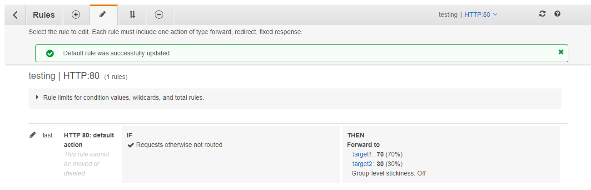
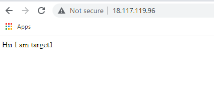
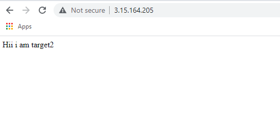

# 26thmay_B1_DEVOPS
## task1

After creating a alb go to

listener-> view/edit rules-> edit target traffic (target1-70%, target2-30%)

intsall apache server in both targets

apt install apache2

for target1 webserver output 

 cd  /var/www/html
 
 
 echo "" > index.html //redirect the content of this file

 
 vim index.html
 
 
 Hii i am target1
 
 And the output is-
 
 
 
 
 
 for target2 webserver output 

 cd  /var/www/html
 
 
 echo "" > index.html //redirect the content of this file

 
 vim index.html
 
 
 Hii i am target2
 
 And the output is-
 
 
 
 
 
 
 
 
 
 
